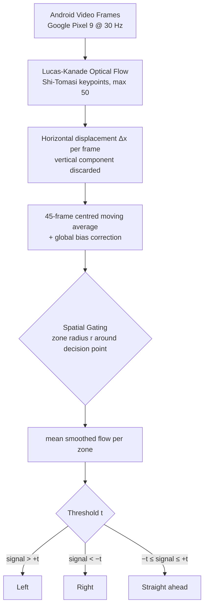

<div align="center">

# Optical Flow Analysis
### Seeing Around the Corner: Fusing Visual Flow and Inertial Sensors for Indoor Pedestrian Navigation

<p><em>Turn-taking prediction at 90 % accuracy using only smartphone video — no training, no maps, no calibration.</em></p>


**Published at [GeoAI 2026](https://doi.org/10.xxxx/xxxxx) — Oral Presentation**
Noah Meißner\*, Tim Sieber\*, Bernd Ludwig — Chair of Information Science, University of Regensburg

</div>

---

## Overview

Indoors, GPS fails — and pedestrian dead reckoning (PDR) based on inertial sensors loses up to **50 % accuracy at turns** compared to straight segments. This repository contains the full pipeline for a study showing that **horizontal optical flow from a standard smartphone camera** can predict turn-taking direction (left / right / straight) with **90 % accuracy** — without any prior mapping, training data, or device-specific calibration.

The key insight: a pedestrian approaching a corner creates a systematic lateral shift in the camera's field of view, which manifests as a directional trend in horizontal optical flow. By restricting analysis to a spatially defined zone around each decision point and aggregating a smoothed flow signal, this simple heuristic nearly eliminates the accuracy drop seen in pure IMU approaches.

> **90 % turn prediction accuracy** across 10 participants on routes up to 399 m — using only Lucas-Kanade optical flow and a single threshold.

---

## Method



### Parameters

| Parameter | Optimal | Description |
|-----------|---------|-------------|
| `zone_radius` | 4.5 m | Radius around a decision point within which flow is evaluated |
| `threshold` | 1.0 | Min. mean flow magnitude to classify a turn (below → straight) |
| `global_bias` | 0.0472 | Systematic offset correction for camera-induced drift |
| `algorithm` | `lucas-kanade` | Optical flow method (`lucas-kanade` or `farneback`) |

Hyperparameters optimised via **Leave-One-Route-Type-Out Cross-Validation (LORTO-CV)** over a grid of 5 radii × 6 thresholds.

---

## Dataset

### Recording Setup

| Device | Role | Data Captured |
|--------|------|--------------|
| **Microsoft HoloLens 2** | Ground-truth reference | 6DoF pose via World-Locking SLAM, ~30 fps |
| **Google Pixel 9** | Target navigation device | RGB video + 3-axis IMU, ~30 fps |
| **Raspberry Pi 5** | Central time server | UDP timestamping (latency: 7.95 ± 0.24 ms) |

Loop closure error: **0.05 % (≈ 8.8 cm)** on the 176 m reference track — sufficient for PDR annotation without offline laser-scan registration.

### Participants & Routes

- **10 participants**, M_age = 23.7 years
- **27 trajectories**: 10 forward, 9 backward, 8 complex
- **3 zone types**: Confined Space (narrow corridors), Open Space (atrium), Transition Zone (courtyard)
- Routes: 176 m reference track + 399 m complex track

---

## Results

### LORTO-CV Results (r = 4.5 m, t = 1.0)

| Fold | Route | N | Accuracy | F1 Left | F1 Straight | F1 Right |
|------|-------|---|----------|---------|-------------|----------|
| 1 | Complex | 56 | 0.93 | 0.77 | 0.87 | 0.99 |
| 2 | Ref (Forward) | 40 | 0.90 | — | — | 0.95 |
| 3 | Ref (Backward) | 36 | 1.00 | 1.00 | — | — |
| **avg** | | **132** | **0.90** | | | |

### vs. IMU Baseline (Jackermeier & Ludwig 2018)

| Method | Accuracy at turns |
|--------|------------------|
| IMU only (prior work) | 0.45 – 0.68 (area match score) |
| **Optical flow (ours)** | **0.90** |

The 50 % accuracy drop at turns in the IMU-only system is nearly eliminated.

---

## Quickstart

```python
from optical_flow.ZoneFlowPredictor import Predictor

predictor = Predictor(
    zone_radius=4.5,      # metres
    threshold=1.0,
    global_bias=0.0472,
    algrthm="lucas-kanade"
)

# df must contain columns: x_new, y_new, android_image_filename
direction = predictor.moved(df, zone_pos=(5400, 2100))
# Returns: "links" | "rechts" | "gerade"
```

Install dependencies:

```bash
pip install opencv-python numpy pandas matplotlib seaborn scikit-learn Pillow
```

The full end-to-end evaluation pipeline (data loading → synchronisation → prediction → ablation study) is in [`Zone_Flow_Predictor.ipynb`](Zone_Flow_Predictor.ipynb).

---

## Project Structure

```text
Optical-Flow-Analysis/
├── optical_flow/
│   ├── motion_flow.py              # Lucas-Kanade and Farneback flow computation
│   └── ZoneFlowPredictor.py        # Predictor class: zone filtering, scoring, classification
├── helper/
│   ├── loader/
│   │   ├── Read_Dataset.py         # Dataset path management
│   │   ├── create_dataframe.py     # Full data pipeline (sync, transform, resize)
│   │   ├── position_alignment.py   # PCA + Manhattan coordinate transformation
│   │   ├── process_helper.py       # CSV loading utilities
│   │   └── evaulation_area.py      # Rectangle-based spatial region definition
│   ├── position/
│   │   ├── parse_acc.py            # Accelerometer CSV parsing
│   │   ├── remove_gravity.py       # EMA gravity removal (α = 0.95)
│   │   └── calc_ego_perspective.py # Egocentric coordinate conversion
│   └── sync/
│       └── synchronise.py          # Cross-device timestamp alignment (17 ms tolerance)
├── Dataset/
│   ├── raw_data/participant_{1-10}/  # Per-participant CSV + image frames
│   ├── merged_data/                  # Preprocessed training set
│   └── eval_data/                    # Held-out evaluation set
├── 01_Data_Quality.ipynb       # Trajectory validation, loop-closure error, outlier detection
├── 02_Predictor.ipynb          # Zone predictor setup and per-zone visualisation
├── 03_Visualisation.ipynb      # Trajectory and optical flow signal plots
└── Zone_Flow_Predictor.ipynb   # Full pipeline: data prep → evaluation → ablation study
```

---

## Notebooks

| Notebook | Description |
|----------|-------------|
| `01_Data_Quality.ipynb` | Loop-closure error, step statistics, outlier flags per trial |
| `02_Predictor.ipynb` | Decision zones overlaid on participant trajectories |
| `03_Visualisation.ipynb` | Optical flow signal plots, accelerometer data |
| `Zone_Flow_Predictor.ipynb` | Full evaluation pipeline: preprocessing → LORTO-CV → ablation study |

---

## Citation

If you use this code or dataset, please cite:

```bibtex
@inproceedings{meissner2026optical,
  title     = {Seeing Around the Corner: Fusing Visual Flow and Inertial Sensors for Indoor Pedestrian Navigation},
  author    = {Mei{\ss}ner, Noah and Sieber, Tim and Ludwig, Bernd},
  booktitle = {Proceedings of the 1st International Conference on Geospatial Artificial Intelligence (GeoAI 2026)},
  year      = {2026},
  address   = {Ghent, Belgium}
}
```

---

## Related Work

This repository accompanies the URWalking indoor navigation system described in [Ludwig et al. 2023](https://doi.org/10.1007/s13218-022-00795-1). The IMU baseline we improve upon is [Jackermeier & Ludwig 2018](https://www.tandfonline.com/doi/abs/10.1080/17489725.2018.1541330).
