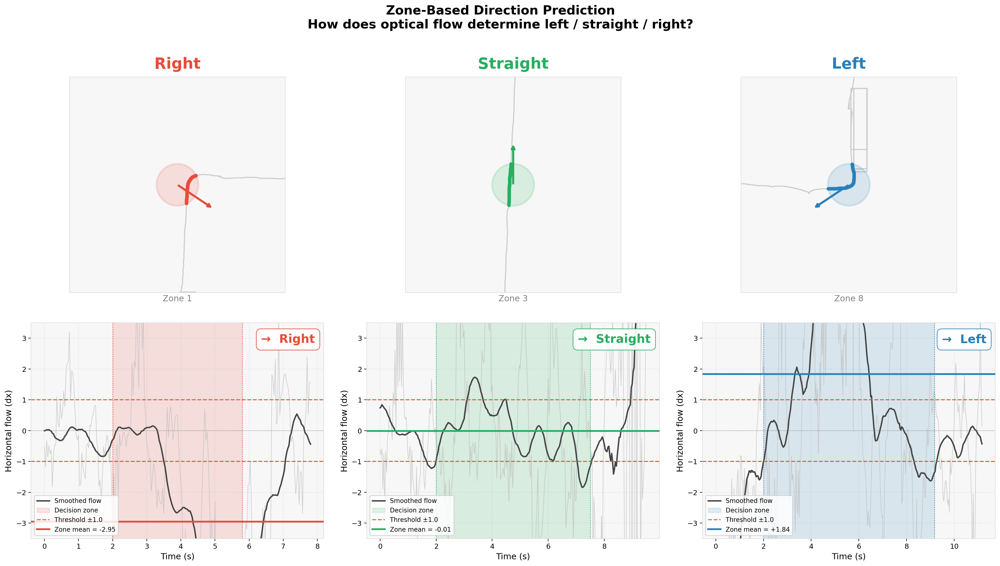
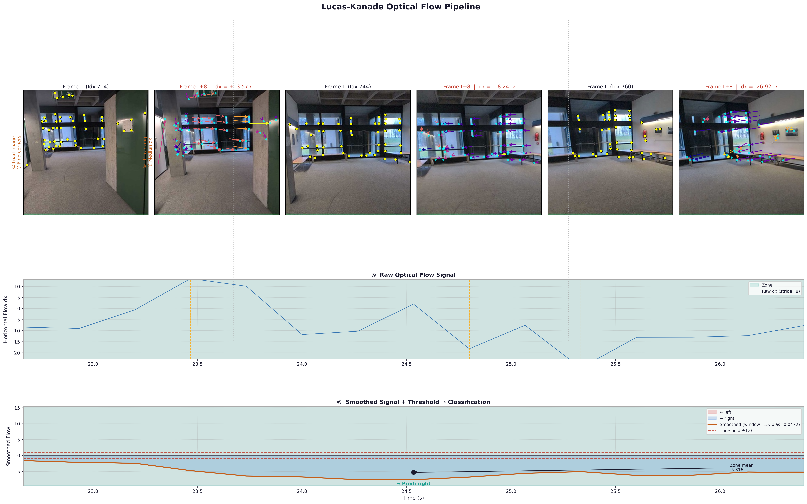
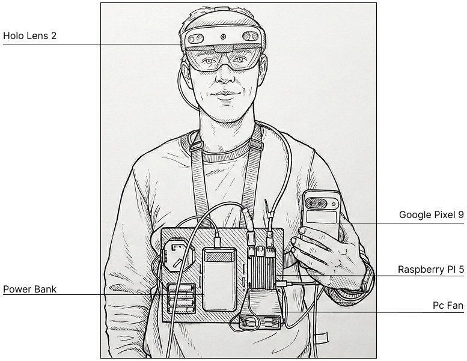
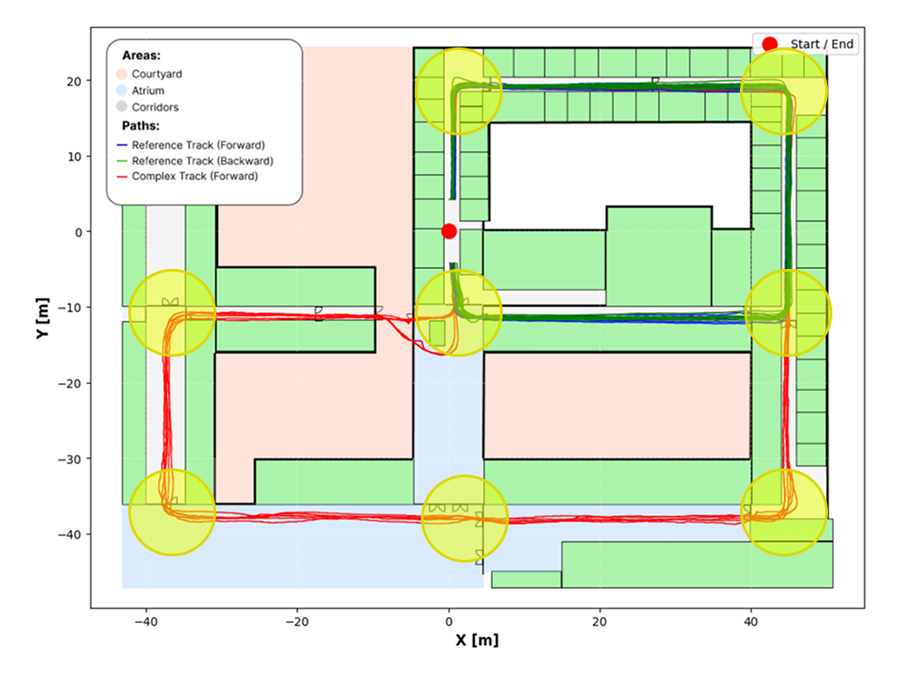

<div align="center">

# Optical Flow Analysis
### Seeing Around the Corner: Fusing Visual Flow and Inertial Sensors for Indoor Pedestrian Navigation

<p><em>90 % turn-prediction accuracy from smartphone video alone — no training, no maps, no calibration.</em></p>


**[Paper (GeoAI 2026)]()** · **[Dataset]()** · Noah Meißner\*, Tim Sieber\*, Bernd Ludwig · University of Regensburg

</div>

---



## Overview

Indoor GPS fails — and IMU-based tracking loses up to 50 % accuracy at turns. We show that **horizontal optical flow from a standard smartphone camera** predicts turn direction (left / right / straight) at **90 % accuracy** across 10 participants on routes up to 399 m, nearly eliminating the turn-accuracy drop from prior work.

For full methodology, dataset details, and results see the [paper](https://doi.org/10.xxxx/xxxxx).

---

## Quickstart

```python
from optical_flow.ZoneFlowPredictor import Predictor

predictor = Predictor(zone_radius=4.5, threshold=1.0, global_bias=0.0472, algrthm="lucas-kanade")

# df must contain columns: x_new, y_new, android_image_filename
direction = predictor.moved(df, zone_pos=(5400, 2100))
# Returns: "links" | "rechts" | "gerade"
```

The full end-to-end pipeline (data loading → sync → prediction → ablation study) is in [`Zone_Flow_Predictor.ipynb`](Zone_Flow_Predictor.ipynb).

---

## How It Works

A pedestrian turning creates a lateral shift in the camera's field of view — a directional trend in horizontal optical flow. We gate analysis to a zone of radius *r* around each decision point and classify the zone mean against a threshold *t*.



| Parameter | Optimal | Description |
|-----------|---------|-------------|
| `zone_radius` | 4.5 m | Radius around a decision point |
| `threshold` | 1.0 | Min. mean flow to classify a turn |
| `global_bias` | 0.0472 | Camera-drift correction |

---

## Dataset

Recording setup: HoloLens 2 (6DoF ground truth) + Google Pixel 9 (video + IMU), synchronised via Raspberry Pi 5 at 7.95 ± 0.24 ms latency. Loop closure error: 0.05 % (≈ 8.8 cm) over 176 m.



- 10 participants · 27 trajectories · 3 zone types
- 176 m reference track + 399 m complex track

<br clear="right">



---

## Notebooks

| Notebook | What it does |
|----------|-------------|
| `01_Data_Quality.ipynb` | Loop-closure error, outlier detection |
| `02_Predictor.ipynb` | Per-zone prediction visualisation |
| `03_Visualisation.ipynb` | Flow signal + trajectory plots |
| `Zone_Flow_Predictor.ipynb` | Full pipeline: data → LORTO-CV → ablation |

---

## Citation

```bibtex
@inproceedings{meissner2026optical,
  title     = {Seeing Around the Corner: Fusing Visual Flow and Inertial Sensors for Indoor Pedestrian Navigation},
  author    = {Mei{\ss}ner, Noah and Sieber, Tim and Ludwig, Bernd},
  booktitle = {Proceedings of the 1st International Conference on Geospatial Artificial Intelligence (GeoAI 2026)},
  year      = {2026},
  address   = {Ghent, Belgium}
}
```
